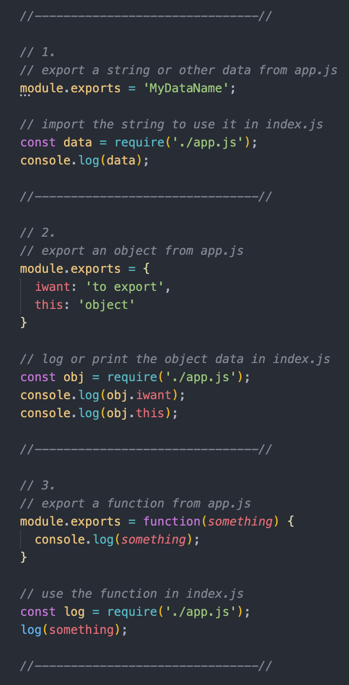
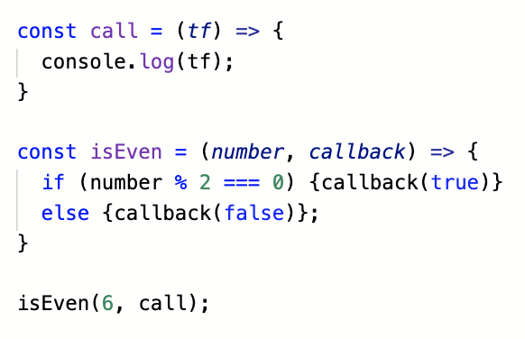

## 401 JavaScript Reading Notes

#### Class-01
 
##### Reading, Research, and Discussion

1. Why would you want to run JavaScript code outside of a browser?
    * Running JS outside of a browser is helpful when creating CLI or back-end applications. 

2. What is the difference between a module and a package?
    * A module is a single file (or set of files within one import) that are utilized by the developer.
    * A package is a collection of modules. 

3. What does the node package manager do?
    * NPM is used publish, discover, install, and develop node programs. 
      * [npm docs](https://docs.npmjs.com/cli/npm.html)
    * It puts modules in place so that node can find them and so that dependency conflicts may be managed effectively.

4. Provide code snippets showing 3 different ways to export a function from a node module.

##### Vocabulary

* `ecosystem`
  * the various libraries, frameworks, and programs which utilize and depend upon a common programming language 
* `Node.js`
  * an open-source development platform for developing server-side applications
* `V8 Engine`
  * a high performance engine which receives/compiles/executes code, handles the callstack, and manages memory
    * [hackernoon](https://hackernoon.com/javascript-v8-engine-explained-3f940148d4ef)
* `module`
  * a single file, or group of files captured in one import, which contain classes or functions to be used by the developer as core features for a specific purpose
    * [mdn](https://developer.mozilla.org/en-US/docs/Web/JavaScript/Guide/Modules)
* `package`
  * a collection of modules
* `node package manager (npm)`
  * a software registry used by developers and organizations to publish, install, and develop note programs
    * [npm docs](https://docs.npmjs.com/cli/npm.html)
* `server`
  * software that satisfies client requests to the web, processes network requests over HTTP, and stores/processes/delivers web pages
    * [wiki](https://en.wikipedia.org/wiki/Web_server)
* `environment`
  * anything installed on the machine where the app is being executed: inclyuding operating system, databases, environment variables, the compilers and interpreters being used, the local network, memory space available, etc.
    * [quora](https://www.quora.com/What-is-the-programming-environment)
* `interpreter`
  * executes instructions written in  without converting them to an object code or machine code 
  * interpreted languages include JavaScript, Perl and Python
    * [geeksforgeeks](https://www.geeksforgeeks.org/compiler-vs-interpreter-2/)
* `compiler`
  * converts an entire program into object code, which can then be directly executed as binary code
  * compiled languages include C and C++
  * Java programs are compiled to an intermediate form, then interpreted
    * [geeksforgeeks](https://www.geeksforgeeks.org/compiler-vs-interpreter-2/)

***

#### Class-02

##### Reading, Research, and Discussion

1. Name 3 advantages to Test Driven Development.
    * Writing code test-first requires you to develop more specific code with clearer aims
    * Reduction of time spent on reworking/refactoring
    * Ability to quickly identify errors and problems

2. In what case would you need to use `beforeEach()` or `afterEach()` in a test suite?
    * If the output of another test is interfering with the outcome of another, we can 'set up' the test environment with `beforeEach()` or 'tear down' the environment with `afterEach()`
      * [jestjs.io](https://jestjs.io/docs/en/setup-teardown)
 
3. What is one downside of  Test Driven Development?
    * Development feels slower in the beginning, since making tests upfront takes a lot of time and effort. 

4. What’s the primary difference between ES6 Classes and Constructor/Prototype Classes?
    * Constructors create Objects, and Prototypes amend/add to those Objects
    * Classes use constructors and methods to create Objects
      * [mdn](https://developer.mozilla.org/en-US/docs/Web/JavaScript/Reference/Classes)

5. Name a use case for a static method.
    * When we need to implement functions that belong to the class, but not necessarily any particular object (instance) of it
    * For example, if we need a function to compare objects of a class, we need to create a static method within the class that targets the objects of that class
      * [js.info](https://javascript.info/static-properties-methods)

6. Write an example of a Higher Order function and describe the use case it solves.

    * In the above example, `isEven()` is a higher-order function
    * Higher-order functions operate on other functions, either by taking them as arguments or by returning them (i.e. any function that takes a callback)
    * Higher-order functions allow us to create smaller, more readable functions to execute smaller pieces of logic (and then use those smaller functions in the higher-order functions)
      * [eloquent js](https://eloquentjavascript.net/05_higher_order.html)

##### Vocabulary

* `functional programming`
  * the process of building software using pure functions, avoiding shared state, mutable data,and side-effects
    * [medium](https://medium.com/javascript-scene/master-the-javascript-interview-what-is-functional-programming-7f218c68b3a0)
* `pure function`
  * a function which, given the same input, will always return the same output and produces no side effects
    * [medium](https://medium.com/javascript-scene/master-the-javascript-interview-what-is-a-pure-function-d1c076bec976)
* `higher-order function`
  * any function which operates on other functions, either by taking them as arguments or by returning them
    * [eloquent js](https://eloquentjavascript.net/05_higher_order.html)
* `immutable state`
  * values of the properties attached to an object will not change over time
    * [stackexchange](https://softwareengineering.stackexchange.com/questions/235558/what-is-state-mutable-state-and-immutable-state)
* `object`
  * a container for properties/values and methods/actions
* `object-oriented programming (OOP)`
  * an approach to software development in which the data structure becomes an object which includes both properties and functions(methods)
  * allows us to create relationships between objects and for objects to inherit from one another
    * [webopedia](https://www.webopedia.com/TERM/O/object_oriented_programming_OOP.html#:~:text=Object%2Doriented%20programming%20(OOP),applied%20to%20the%20data%20structure.)
* `class`
  * functions which use constructors and methods to create objects
    * [mdn](https://developer.mozilla.org/en-US/docs/Web/JavaScript/Reference/Classes)
* `prototype`
  * a javascript property which allows us to add new properties or methods to object constructors
    * [w3schools](https://www.w3schools.com/js/js_object_prototypes.asp)
* `super`
  * the keyword used to access and call functions on an object's parent class
    * [mdn](https://developer.mozilla.org/en-US/docs/Web/JavaScript/Reference/Operators/super)
* `inheritance`
  * private properties linking javascript objects from the highest parent object to its last child object
    * [mdn](https://developer.mozilla.org/en-US/docs/Web/JavaScript/Inheritance_and_the_prototype_chain)
* `constructor`
  * a method for creating and initializing an object of a given class
* `instance`
  * one object of a given class OR
  * one `new Object()` created from a constructor
* `context`
  * the value of `this` 
  * (think: 'in which object am i operating?')
* `this`
  * the object that owns the code being executed currently
* `Test Driven Development (TDD)`
  * a style of programming characterized by writing a single unit test first, then writing just enough code to make the test pass, then refactoring for simplicity, then repeating, accumulating unit tests over time
    * [agile alliance](https://www.agilealliance.org/glossary/tdd)
* `Jest`
  * a javascript testing framework
    * [jestjs.io](jestjs.io)
* `Continuous Integration (CI)`
  * the process of merging all devs' working copies to a shared main branch repeatedly throughout the development process
* `unit test`
  * tests to check single parts of code to ensure that they run as expected & return an expected output
    * [freecodecamp](https://www.freecodecamp.org/news/how-to-start-unit-testing-javascript/)

***

#### Class-03

##### Reading, Research, and Discussion

1. Why would a developer choose to make data models?
    * A well-done data model can make complex applications more scalable; gaining direct access to app infrastructure can make navigating changes more simple
      * [hackernoon](https://hackernoon.com/making-a-case-for-domain-modeling-17cf47030732)
2. What purpose do CRUD operations serve?
    * Allowing for persistent storage within applications/databases
      * [stackify](https://stackify.com/what-are-crud-operations/)
3. What kind of database is Postgres? MongoDB?
    * Postgres is a relational database
    * MongoDB is a non-relational database
4. What is Mongoose and why do we need it?
    * Mongoose is an object modeling tool designed for use with MongoDB.
      * [freecodecamp](https://www.freecodecamp.org/news/introduction-to-mongoose-for-mongodb-d2a7aa593c57/)
5. Define three related pieces of data in a possible application. An example for a store application might be Product, Category and Department. Describe the constraints and rules on each piece of data and how you would relate these pieces to each other. For example, each Product has a Category and belongs in a Department.
    * Table - a collection of related records within a database
    * Record - a single line with a unique ID within a database table 
      * `(Object{id})`
    * Field - a single piece of data within a record 
      * `({property: value})` 

##### Vocabulary

* `database`
  * an organized collection of information, accessed electronically via query languages
* `data model`
  * a diagram of organized elements of data which illustrates how those elements of data relate to one another
    * [hackernoon](https://hackernoon.com/making-a-case-for-domain-modeling-17cf47030732)
* `CRUD`
  * Functions of Persistent Storage: Create, Read, Update, Delete
    * [stackify](https://stackify.com/what-are-crud-operations/)
* `schema`
  * a skeleton structure representative of the logical view of an entire database
    * [tutorials point](https://www.tutorialspoint.com/dbms/dbms_data_schemas.htm)
* `sanitize`
  * the process of removing data with the purpose of making it unrecoverable
  * generally used to protect systens from malicious data
    * [medium](https://medium.com/@abderrahman.hamila/what-sanitize-mean-and-why-sanitize-in-code-data-5c68c9f76164)
* `Structured Query Language (SQL)`
  * the standard language for relational database management
    * [sqlcourse](http://www.sqlcourse.com/intro.html)
* `Non SQL (NoSQL)`
  * non-relational databases which provide flexible schemas, scale easily, and can handle large amounts of data and high user loads
    * [mongodb](https://www.mongodb.com/nosql-explained)
* `MongoDB`
  * a NoQL document-oriented database program
    * [mongodb](https://www.mongodb.com/)
* `Mongoose`
  * an object modeling tool designed for use with MongoDB
    * [freecodecamp](https://www.freecodecamp.org/news/introduction-to-mongoose-for-mongodb-d2a7aa593c57/)
* `record`
  * a basic data structure composed of collections of elements
    * [wiki](https://en.wikipedia.org/wiki/Record_(computer_science))
* `document`
  * JSON data stored in a database 
    * [mongodb](https://www.mongodb.com/document-databases)
* `Object Relation Mapping (ORM)`
  * a programming technique for bridging between objects and tables
  * ORM libraries take care of the bridging mechanics and
  * allow the user to interact directly with the objects in the user's preferred language
    * [stackoverflow](https://stackoverflow.com/questions/1279613/what-is-an-orm-how-does-it-work-and-how-should-i-use-one)

***

#### Class-04

##### Reading, Research, and Discussion

1. Give one strong argument for and against NoSQL Databases.
    * Pro: Flexible Data Models
      * NoSQL Databases easily store and combine any type of data, whether structured or unstructured. Schemas can be updated dynamically when needed without downtime or interruption
        * [mongodb](https://www.mongodb.com/scale/nosql-databases-pros-and-cons)
    * Con: Sacrificing referential integrity/data consistency for speed
      * With SQL Databases, we are bound by referential tables
      * With NoSQL Databases, we aren't imposing any logical consistency across tables by default; instead we need to build integrity mechanisms into the code
        * [quora](https://www.quora.com/What-are-the-pros-and-cons-of-NoSQL-databases)
2. Name 3 cloud based NoSQL Databases
    * Amazon DynamoDB 
      * [aws](https://aws.amazon.com/dynamodb/)
    * Oracle 
      * [oracle](www.oracle.com)
    * MongoDB Atlas 
      * [mongodb](https://www.mongodb.com/cloud/atlas)

##### Vocabulary
* `database`
  * an organized collection of information, accessed electronically via query languages
* `data model`
  * a diagram of organized elements of data which illustrates how those elements of data relate to one another
    * [hackernoon](https://hackernoon.com/making-a-case-for-domain-modeling-17cf47030732)
* `CRUD`
  * Functions of Persistent Storage: Create, Read, Update, Delete
    * [stackify](https://stackify.com/what-are-crud-operations/)
* `schema`
  * a skeleton structure representative of the logical view of an entire database
    * [tutorials point](https://www.tutorialspoint.com/dbms/dbms_data_schemas.htm)
* `sanitize`
  * the process of removing data with the purpose of making it unrecoverable
  * generally used to protect systens from malicious data
    * [medium](https://medium.com/@abderrahman.hamila/what-sanitize-mean-and-why-sanitize-in-code-data-5c68c9f76164)
* `Structured Query Language (SQL)`
  * the standard language for relational database management
    * [sqlcourse](http://www.sqlcourse.com/intro.html)
* `Non SQL (NoSQL)`
  * non-relational databases which provide flexible schemas, scale easily, and can handle large amounts of data and high user loads
    * [mongodb](https://www.mongodb.com/nosql-explained)
* `MongoDB`
  * a NoQL document-oriented database program
    * [mongodb](https://www.mongodb.com/)
* `Mongoose`
  * an object modeling tool designed for use with MongoDB
    * [freecodecamp](https://www.freecodecamp.org/news/introduction-to-mongoose-for-mongodb-d2a7aa593c57/)
* `record`
  * a basic data structure composed of collections of elements
    * [wiki](https://en.wikipedia.org/wiki/Record_(computer_science))
* `document`
  * JSON data stored in a database 
    * [mongodb](https://www.mongodb.com/document-databases)
* `Object Relation Mapping (ORM)`
  * a programming technique for bridging between objects and tables
  * ORM libraries take care of the bridging mechanics and
  * allow the user to interact directly with the objects in the user's preferred language
    * [stackoverflow](https://stackoverflow.com/questions/1279613/what-is-an-orm-how-does-it-work-and-how-should-i-use-one)

***

#### Class-05

##### Linked Lists

* When To Use Linked Lists
  * for tasks that require insert/delete.
  * when data storage space is limited
  * when the list may grow
   (size unknown at start)

* When to Use Arrays
  * for tasks that require searching
  * when data storage space is not a concern
  * when the list will not grow in size

* Singly linked lists contain nodes that store only two properties: 
  * the value of the contents of the node
  * a reference to the next node in the list

* Doubly linked lists contain nodes that store three properties:
  * the value of the node contents
  * the reference to the next node
  * a reference to the previous node. 

***

#### Class-06

##### HTTP and REST

* HTTP (Hyper Text Transfer Protocol)
  * Apps built using HTTP subscribe to the cient-server computing model
    * server = host designed to provide the service
    * client = hosts that make requests to the service
  * HTTP Requests
    * GET method -> retrieve a resource
    * HEAD -> retrieve headers
    * POST -> create a resource
    * PUT -> update a resource by replacing it
    * DELETE -> delete a resource
    * CONNECT -> create a TCP/IP tunnel (communicate between 2 networks)
    * OPTIONS -> returns supported methods for a URL
    * TRACE -> echos retrieved request (used for debugging)
    * PATCH -> modify specific parts of a resource
      * [mdn](https://developer.mozilla.org/en-US/docs/Web/HTTP/Methods)
  * HTTP Response
    * First line contains HTTP Version (i.e. HTTP/1.1), Status Code (i.e. 200), and Status Message(i.e. 'OK')

* REST (Representational State Transfer)
  * REST Methods allow us to perform actions on data returned from RESTful API calls
    * CREATE -> Create a new record
      * like HTTP POST
    * READ -> Retrieve records
      * like HTTP GET
    * UPDATE
      * like HTTP PUT or PATCH
    * DELETE -> Remove a record

***

#### Class-07

##### Express MiddleWare

* Functions that requests are routed through
* Receive a request object, response object, and the next middleware function in the req/res cycle
  * if the function doesn't end the req/res cycle, it must call next() or the request will run for ever and ever and ever and ever and-
* order matters (a lot) when coding middleware functions
* application middleware handles:
  * errors
  * importing other routes
  * applying defaults
  * parsing
* route middleware handles:
  * logging
  * model loading
  * browser/location/user specific content
  * pre-rendering
* built-in middleware functions include:
  * express.static -> serves static assets such as HTML files, images, etc.
  * express.json -> parses incoming requests with JSON payloads
  * express.urlencoded -> parses incoming requests with URL-encoded payloads
  * [express](https://expressjs.com/en/guide/using-middleware.html#middleware.built-in)
    
***

#### Class-08
 
##### Express Routing
* Router is essentially a mini express application
  * It provides us with routing APIs:
    * .use
    * .get
    * .param
    * route
  * Basic routes include simple page routing with callback functions
  * Route middleware includes functions we want to run before information is loaded to the user:
    * logging
    * pre-rendering
    * user authentication
  * Routes with parameters (i.e. '/route/:parameter') send or populate data that is specific to a parameter value
    * parameters are validated using .param()
* Route functions take two mandatory arguments: request, response
  * Request Objects can take parameters or query strings
  * Response Object is responsible for sending data back to the browser
    * sends status code
    * sends data objects

***

#### Class-09
 
##### Sub Documents in Mongoose
* Subdocuments are documents embedded in other documents; they come in two types:
  * arrays of subdocuments
  * arrays of subdocuments
* They enable us to nest schemas within other schemas 
* Nested schemas can have middleware, validation, and any other feature normally accessible to schemas
* However, subdocuments are not saved on their own; they are only saved whenever their parent document is saved
* [mongoose](https://mongoosejs.com/docs/subdocs.html)

##### Joining Documents in Mongo
* Virtual Joins
  * `const Schema1 = new Schema({})`
  * `const Schema2 = new Schema({})`
  * `------`
  * `Schema2.virtual('items', { ref: 'Model1 }`
  * `------`
  * `const Model1 = mongoose.model('Model1', Schema1)`
  * `const Model2 = mongoose.model('Model2', Schema2)`
  * `------`
  * By making reference to the model we want to link our schema to, we can join them. 
* [mongoose](https://mongoosejs.com/docs/populate.html#populate-virtuals]

***

#### Class-10

##### Stacks
* Stacks are structures that consist of nodes
* When referencing actions performed on stacks, we use the following terms:
  * Push -> items added into the stack are pushed (like arrays)
  * Pop -> items removed from the stack are popped (like arrays)
  * Top -> this is the top node in the stack
  * Peek -> peeking gives you the value of the top node in the stack
  * isEmpty -> returns true when the stack is empty, else returns false
* Stacks follow FILO and LIFO concepts
  * FILO -> first in/last out -> the first item added to the stack will be the last one popped out
  * LIFO -> last in/first out -> the last item added to the stack will be the first one popped out
  
##### Queues
* Queue Vocab
  * Enqueue -> Nodes that are added to the queue
  * Dequeue -> Nodes that are removed from the queue
  * Front -> The first Node of the queue
  * Rear -> The last Node of the queue
  * Peek -> gives you the value of the front Node in the queue
  * IsEmpty -> returns true when the queue is empty, else false
* Queues also follow FIFO and LILO concepts
  * FIFO -> first in first out -> first item in the queue will be the first item out of the queue
  * LILO -> last in last out -> last item in the queue will be the last item out of the queue
  
  ***

#### Class-11

##### Authentication
* Router Middleware
  * Middleware functions have access to the request object, response object, and the next middleware function in the web request-response cycle
  * Middleware functions can:
    * execute any code
    * make changes to the request and/or response objects
    * end the request-response cycle
    * call the next middleware function in the stack
  * Express apps can use:
    * application-level middleware - `app.httpmethod(function)` or `app.use(function)`
    * router-level middleware - `const router = express.Router` -> `router.use(function)` or `router.httpmethod(function)`
    * error-handling middleware - `app.use(function(err, req, res, next)`
      * takes four arguments; in addition to req, res, next, we add err
    * built-in middleware
      * `express.static` serves static assets such as HTML files and images
      * `express.json` parses requests with JSON payloads
      * `express.urlencoded` parses incoming requests with url-encoded payloads
    * third-party middleware
      * dependencies that we install with node which add specific functionalities to express applications
* Dynamic Module Loading
  * wrapping imports in async functions
  `async function loadPage() { await import('file/path/filename.js); code to run after completion of import goes here }`
    *[github](https://gist.github.com/Rich-Harris/ea561810900eedd2a8e9afbc78ddd566)
* Singleton Pattern
  * The Singleton Pattern involves a single class responsible for creating an object while ensuring that only a single object gets created
  * The object can be accessed directly without needing to instantiate the object class, as it has been automatically instantiated upon its creation
    * [tutorialspoint](https://www.tutorialspoint.com/design_pattern/singleton_pattern.htm)
* CRUD -> REST Method Matches
  * Create - POST
  * Read - GET
  * Update - PUT
  * Delete - DELETE
* Mock Testing
  * Mock functions allow us to test code by 'erasing' the actual implementation of the function, instead creating mock situations to base our code connection tests on. 

***

#### Class-12
 
##### OAuth
* Why is authentication important?
  * Protecting a user's private or sensitive information
* Why should we be careful about storing users' passwords?
  * Data breaches occur often, and if we are not careful about the information we store along with encrypted passwords, we could be giving hints to how to easily decrypt them. 
* What is the difference between hashing and encryption?
  * Hashing is a one-way irreversible data conversion using alphanumeric characters to produce a new key, a complex string of letters and numbers
  * Encryption is a secure encoding technique in which data is encoded using an algorithm which only authorized personnel have access to
    * [geeksforgeeks](https://www.geeksforgeeks.org/encryption-encoding-hashing/)
* What is the difference between encryption and encoding?
  * Encoding is the reversible process of changing data into a new format 
  * Encryption is a secure encoding technique (see above)
    * [geeksforgeeks](https://www.geeksforgeeks.org/encryption-encoding-hashing/)
* What is a token used for?
  * Secure information transmission
  * Persistence of user authorization

##### Vocabulary
* `authentication`
  * the verification of human-server transfer of credentials 
* `authorization`
  * the validation of which functions of an application the user has access to
    * [medium](https://medium.com/capital-one-tech/securing-applications-with-better-user-authorization-625ec07a7001)
* `session`
  * characterized as a temporary interactive information exchange between two web clients, or between a web client and a user
    * [wikipedia](https://en.wikipedia.org/wiki/Session_(computer_science))
* `cookie`
  * small bits of data stored by browsers which track stateful information (i.e. browsing activity, logins, clicks, shopping carts)
* `token`
  * a complex string of base64 characters which is granted to the user after authentication and authorization
    * [jwt.io](https://jwt.io/introduction/)
* `basic auth`
  * the simplest auth technique, which encodes data with base64
  * generally combined with HTTPS to provide confidentiality of data
    * [swagger.io](https://swagger.io/docs/specification/authentication/basic-authentication/)
* `secret`
  * a key used in conjunction with a client id to be used for OAuth
* `cryptography`
  * the study and practice of secure communications techniques which allow only the sender and intended recipient to view sent data
    * [kaspersky](https://usa.kaspersky.com/resource-center/definitions/what-is-cryptography)
